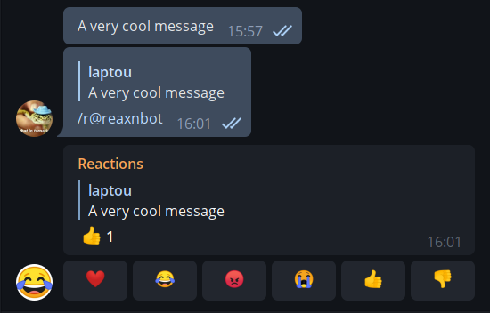

# Reaction Bot

Facebook Messenger and iMessage have features that allow you to react to
messages with emojis - it's an inline, low-key way to acknowledge a message when
you don't have anything else to say. However, this feature is still missing from
Telegram, so this bot serves as a sort of polyfill.

## How to use it (for Telegram users)

- Add [@reaxnbot](https://t.me/reaxnbot) to a group chat
- Reply to any message with the `/r` command directed at `@reaxnbot` (you can just type `/r` and it should just work)
- `@reaxnbot` responds with an empty message with emoji buttons, and anyone can
  tap them to react

- If you don't want your chat littered with `/r`s, then give the bot permissions
  to delete messages and it will automatically delete the `/r` messages.

## How to use it (for developers)

- Obtain a bot token from the [BotFather](https://t.me/botfather)
- `TELOXIDE_TOKEN=<your token here> cargo run`

## EAQ (Easily anticipated questions)

> Why does this bot have the ability to read all messages in my group chat?

Due to the [way the Telegram Bot API works](https://core.telegram.org/bots/faq#what-messages-will-my-bot-get), replying to a message with a bot command doesn't let the bot see which message you're replying to. This bot would be a lot less useful if it wasn't clear which message the reaction was for, so this is a no-go.

The bot completely ignores messages that are not commands directed at it, and
does not read the contents of the messages you use it to react to.

> I don't want this bot to delete my `/r` messages. / I don't trust this bot not to delete anything else.

Then don't give the bot deletion permissions.

## License

This code is MIT licensed. Copyright &copy; 2020 Ibiyemi Abiodun.
